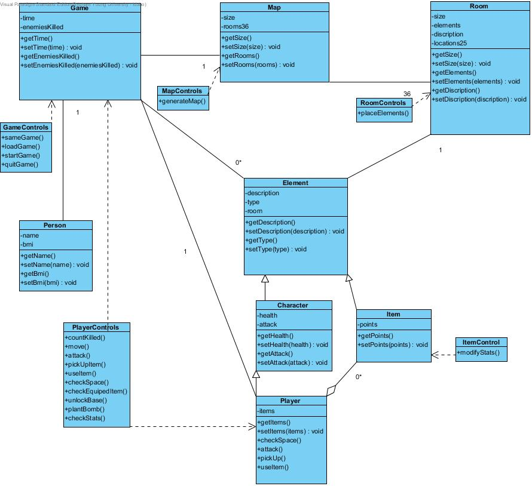
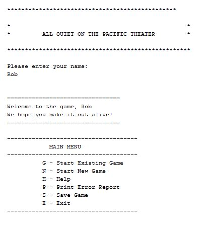
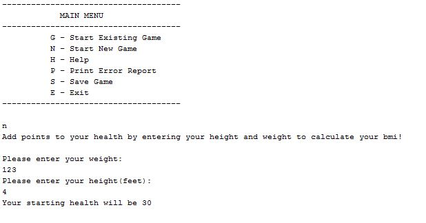
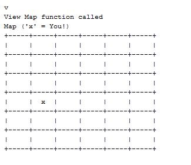
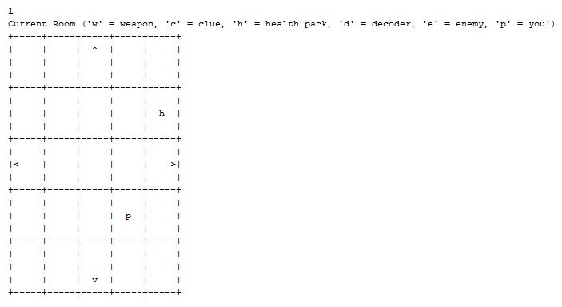
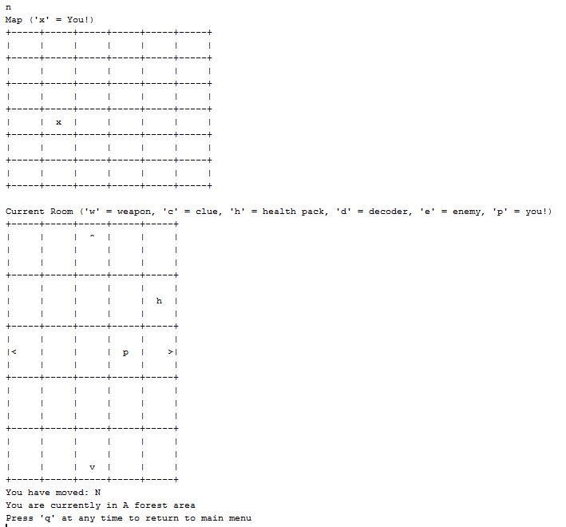
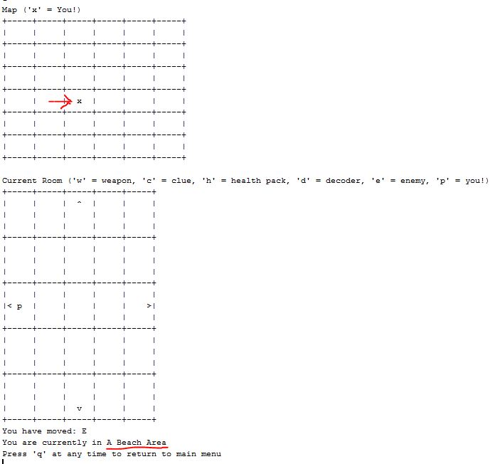
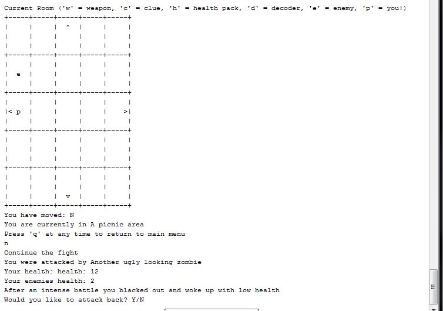

##Too Quiet on the Pacific Theater

###Description 
This is a text-based RPG. You play the part of a young man newly enlisted in the American army in 1944. After intense assessments you are put on a special team and sent to an uncharted island in the south pacific for a top secret mission. Your briefing is vague and unspecific but you deduct that the Nazis have been conducting experiments and developing a weapon of some sorts on this island.  

The game map consists of 6x6 squares and each square will be a 5x5 “room” or area that contains either enemies items or animals. As you go through this room you will explore unidentified tiles that, as you walk over them, will reveal what is in that tile and an interaction will take place. These interactions can include a battle or initiate end user stories such as pick up item.

###Quick video demo
[Too Quiet on the  Pacific Theater Video Demo](https://www.youtube.com/watch?v=m8FvUzBhiUM)
 

###Our UML Diagram

####Start the program 
The program is started by the user and the computer displays a title screen, the player is prompted for a name. A main menu is then displayed.

####Start a game
This will be an option that allows the user to start a new game. It will prompt the user for thier height and weight and set their health to their bmi.

####Game menu 
The game menu is basically just a key of the input the user can put in:
![UML]menu.JPG)

####View the map
Your character will start at the far right bottom corner of the map. The map will be a 6x6 box each unvisited square will have a ‘?’ at the top showing that you have not yet visited it. You will have to make your way through the different locations or “rooms” on the map and search for different items.

####Look around a “room”
Rooms will contain various items, enemies or animals, denoted by an “i” for  investigatable object.  Your player will be shown as an ‘x’ on the screen. When you choose to look around a “room”, the description from when you first entered the room will appear on the bottom of the screen along with the map of the room. Investigated objects will be denoted by a letter showing what kind of object identified unless it was picked up or killed. d for decoder, w for weapon, h for health-pack, and e for enemy.

####Moving around a “room”
Using the N, E, S and W commands you can move your character around the board. When a character moves on top of an investigatable object the nature of the object will be revealed and the user will be prompted to pickup an item, attack an enemy or flee an enemy.  

####Move to a new location
You will move your character around the map looking for weapons/clues etc. Whenever you enter a new room by moving out of the room frame, a description of the room will appear along with the map of the new room you have entered.

####View list of inventory items
You will have a list of items contained in your inventory, which you can view, and then use or equip said items. These items affect combat and have various uses. Each item will have a unique key binded to it that you will press to equip it.

####Pick up an item
Each room will contain various things to interact with, one or more of which will be an item. When you move onto the space with the item, you will be prompted whether or not you want to pick that item up and place it in your inventory or leave it there.

####Use an item
Throughout the game there will be various useable items and events that require the use of a specific item, you will be prompted if you have the item if you want to use it, and if you don’t have it you will be prompted to go find it.

####Equip item
This option allows the user to equip an item that is in his inventory that is also equippable. These will be items that modify attack or defense

####Attack
This is a scene in which the user will battle some sort of enemy. You will have an attack and defense modifier and some health. The items you have equipped will effect these attributes, and the enemy will have similar attributes.

####End Game
The game is ended by defeating 10 enemies
